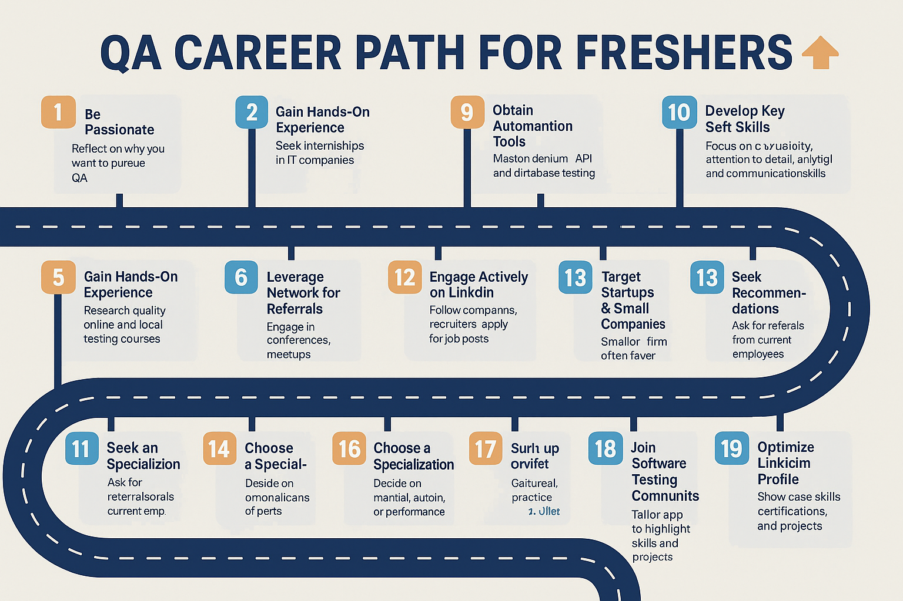

## How to Get a Job in Software Testing as a Fresher 🚀
**Author:** Lamhot Siagian 🔗 [LinkedIn](https://www.linkedin.com/in/lamhotsiagian)

---

Entering the world of software testing can feel overwhelming, especially without prior experience. This guide provides actionable steps to help you build a strong foundation, stand out to employers, and land your first QA role. 💼

## 1. 🎯 Cultivate a Passion for Testing
- 🔍 **Reflect on your motivation**:
    - What excites you about testing over development? 💡
    - If you have a CS background, why QA instead of coding? 🖥️
    - If you’re from another field, what draws you to software testing? ✨
- 🗣️ Prepare clear, honest answers for interviews.

## 2. 📚 Recommended Reading
Start with introductory texts, then dive deeper as you gain experience:
- **Software Testing** by Ron Patton 📖
- **Lessons Learned in Software Testing** by Cem Kaner 💡
- **More Agile Testing** by Lisa Crispin & Janet Gregory 🔄
- **How Google Tests Software** by Whittaker, Arbon & Carollo 🌐
- **A Practitioner’s Guide to Software Test Design** by Lee Copeland 🛠️
- **Scrum and XP from the Trenches** by Henrik Kniberg 🏗️

## 3. 🔧 Gain Hands-On Experience with Internships
- 🚀 Apply for testing internships or externships in IT companies.
- 🤝 Take initiative, add value, and build relationships—many interns receive full-time offers upon graduation.

## 4. 🎓 Enroll in Targeted Courses
- 🔍 Research online and local courses covering testing fundamentals, programming basics, and interview skills.
- 🏆 Read reviews and testimonials; consult peers to avoid low-quality programs.

## 5. 🤝 Leverage Your Network for Referrals
- 📞 Ask seniors, alumni, and professional contacts for introductions to hiring managers.
- 🗓️ Attend testing conferences, workshops, and meetups to expand your network.

## 6. 💬 Engage Actively on LinkedIn
- 👥 Follow companies and recruiters in QA.
- ✉️ Apply to job posts promptly with a tailored cover letter and portfolio links.
- 📝 Showcase your learnings through posts or short articles.

## 7. 🏅 Obtain an ISTQB Foundation Certificate
- 🎓 The ISTQB CTFL certifies your basic testing knowledge and strengthens your resume.

## 8. 🤖 Learn Automation Tools
- 🌐 Master **Selenium** for web testing.
- 🚀 Explore **Playwright** or **Protractor** for modern frameworks.
- 🔌 Practice API testing with **Rest Assured** and basic database testing.

## 9. ☁️ Explore DevOps and CI/CD
- 🔄 Familiarize yourself with **Jenkins**, **Docker**, **Kubernetes**, and **AWS**.
- 📈 Understanding CI/CD pipelines complements your testing skill set and accelerates deployments.

## 10. 🧠 Develop Key Soft Skills
- 🕵️‍♀️ **Curiosity**: Always seek what’s behind the obvious.
- 🎯 **Attention to Detail**: Spot what others miss.
- 🧮 **Analytical Thinking**: Create effective test cases.
- 🗣️ **Clear Communication**: Write precise bug reports.
- 🚀 **Fast Learning**: Adapt to new tools and methodologies.
- 🤝 **Teamwork**: Collaborate seamlessly with developers and stakeholders.

## 11. 📊 Master Core Testing Concepts
- 🔄 Understand SDLC and STLC stages.
- ✅ Learn various testing types (functional, regression, performance) and levels (unit, integration, system).
- 📜 Explore methodologies: Waterfall, V-Model, Agile, Scrum.
- ✍️ Practice writing test plans, cases, and checklists.
- 🐞 Get comfortable with bug-tracking tools like JIRA.

## 12. 📝 Craft an Outstanding Resume & Cover Letter
- 🔍 Analyze each job description and highlight matching keywords.
- 💼 Showcase relevant projects, tools, and certifications.
- 🧐 Proofread meticulously to demonstrate your attention to detail.
- ✉️ Customize your cover letter for every application.

## 13. 🌟 Choose a Specialization
Differentiate yourself by focusing on one area while maintaining general QA knowledge:
- 🖐️ **Manual Testing**: Simulate end-user behavior.
- 🤖 **Automation Testing**: Write scripts to automate repetitive tests.
- ⚡ **Performance Testing**: Evaluate software under varying loads.

## 14. 💰 Seek Recommendations
- 🎁 Ask current employees for referral bonuses.
- 📱 Reach out to friends, family, or contacts working in QA roles.

## 15. 🚀 Target Startups & Small Companies First
- 🏢 Smaller firms often take a chance on freshers.
- ⏩ You’ll gain broader responsibilities and rapid growth opportunities.

## 16. 🛠️ Solidify Your Fundamentals
- 🔍 Review testing techniques, lifecycle, and bug-life cycle.
- 🌐 Brush up on HTML, CSS, JavaScript, SQL, and command-line basics.
- 🐧 Gain familiarity with UNIX/Linux systems and networking concepts.

## 17. 🌐 Sign Up on uTest
- 🖥️ Join uTest for real-world testing projects and community learning.

## 18. 💬 Join Software Testing Communities
- 🌍 Participate in online forums and associations (e.g., Ministry of Testing).
- 📢 Attend webinars, local meetups, and conferences.

## 19. 🔍 Optimize Your LinkedIn Profile
- 📸 Use a professional photo and headline (e.g., “Aspiring QA Engineer | Automation Enthusiast”).
- 🛠️ Detail your skills, certifications, and hands-on projects.
- 👍 Ask for endorsements and recommendations.

---

## 📖 References
1. [Software Testing Help: How to Get a Testing Job as a Fresher](https://www.softwaretestinghelp.com/how-to-get-a-software-testing-job-as-a-fresher/)
2. [Tester Tips: How to Get a Software Testing Job Without Experience](https://testertips.com/how-to-get-software-testing-job-without-experience/)
3. [Quora: How Do I Get a Job in Software Testing as a Fresher?](https://www.quora.com/How-do-I-get-job-in-software-testing-as-a-fresher)
4. [Careerist: How to Get a Software Testing Job Without Any Experience](https://www.careerist.com/insights/how-to-get-a-software-testing-job-without-any-testing-experience/)
5. [Indeed: How to Find Testing Fresher Jobs](https://www.indeed.com/career-advice/finding-a-job/how-to-get-testing-fresher-jobs)
6. [The Test Tribe: How to Get a Job in Software Testing as a Fresher](https://www.thetesttribe.com/how-to-get-a-software-testing-job-as-a-fresher/)
7. [TestProject Blog: Steps to Find a QA Job Without Experience](https://blog.testproject.io/2021/01/25/steps-to-find-a-job-in-qa-with-no-experience/)
8. [Software Tester Careers](https://softwaretester.careers/how-to-get-a-software-testing-job-as-a-fresher/)  
