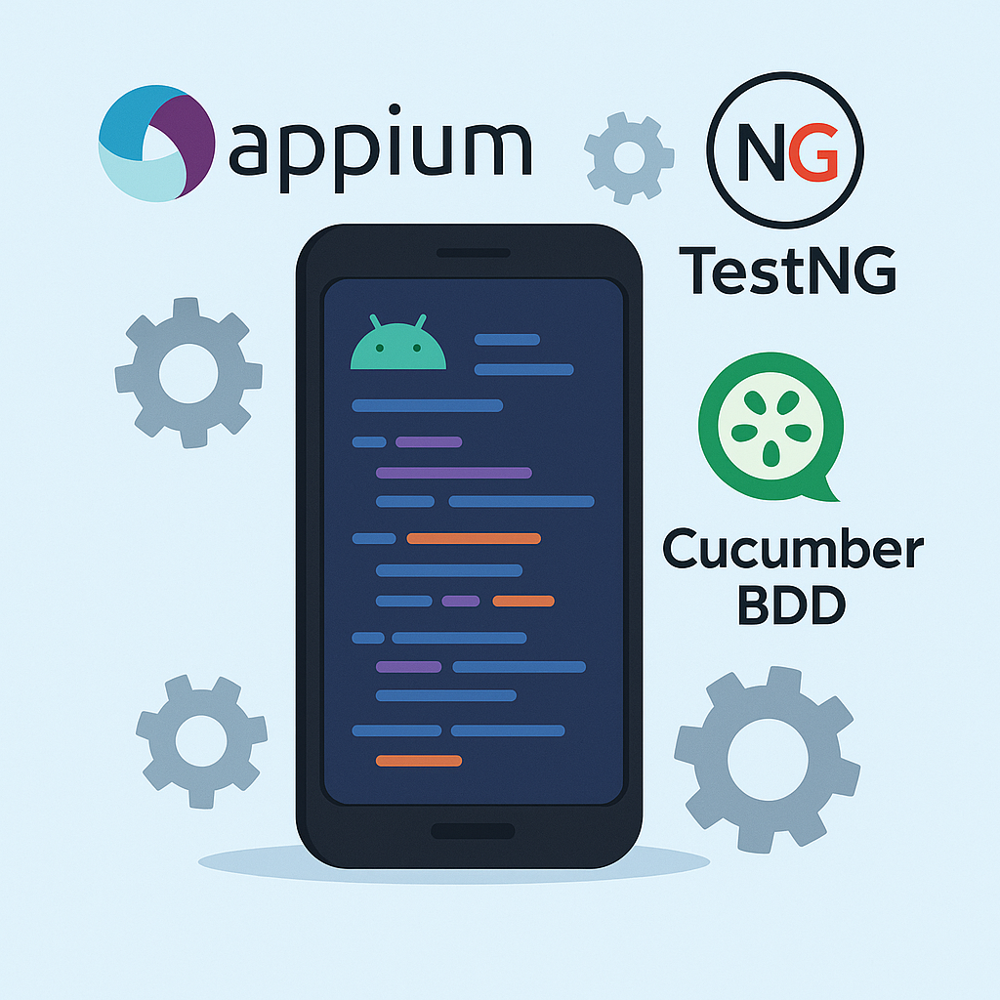
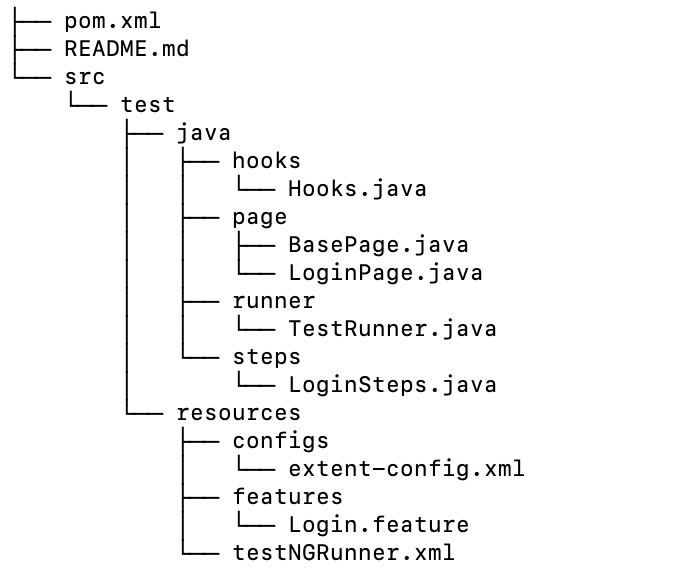

# Automation Mobile Android Testing using Appium, TestNG, and Cucumber BDD
**Author:** Lamhot Siagian 🔗 [LinkedIn](https://www.linkedin.com/in/lamhotsiagian)




## 1. Create the project root and basic folders

---

## 2. `src/test/resources/configs/extent-config.xml`

```xml
<?xml version="1.0" encoding="UTF-8"?>
<extentreports>
  <configuration>
    <reportName>Appium BDD Test Report</reportName>
    <documentTitle>Test Results</documentTitle>
    <reportHeadline>Automation Test Results</reportHeadline>
  </configuration>
</extentreports>
```
---

## 3. `pom.xml`

Create **`pom.xml`** in the project root:

```xml
<project xmlns="http://maven.apache.org/POM/4.0.0"
         xmlns:xsi="http://www.w3.org/2001/XMLSchema-instance"
         xsi:schemaLocation="http://maven.apache.org/POM/4.0.0
                             http://maven.apache.org/xsd/maven-4.0.0.xsd">
  <modelVersion>4.0.0</modelVersion>
  <groupId>com.example</groupId>
  <artifactId>appium-bdd-java-testng</artifactId>
  <version>1.0-SNAPSHOT</version>
  <properties>
    <maven.compiler.source>1.8</maven.compiler.source>
    <maven.compiler.target>1.8</maven.compiler.target>
    <cucumber.version>7.11.0</cucumber.version>
    <selenium.version>4.1.4</selenium.version>
    <appium.version>8.4.0</appium.version>
    <testng.version>7.4.0</testng.version>
    <extent.version>5.0.9</extent.version>
  </properties>
  <dependencies>
    <!-- Cucumber & TestNG -->
    <dependency>
      <groupId>io.cucumber</groupId>
      <artifactId>cucumber-java</artifactId>
      <version>${cucumber.version}</version>
    </dependency>
    <dependency>
      <groupId>io.cucumber</groupId>
      <artifactId>cucumber-testng</artifactId>
      <version>${cucumber.version}</version>
    </dependency>

    <!-- Selenium & Appium -->
    <dependency>
      <groupId>org.seleniumhq.selenium</groupId>
      <artifactId>selenium-java</artifactId>
      <version>${selenium.version}</version>
    </dependency>
    <dependency>
      <groupId>io.appium</groupId>
      <artifactId>java-client</artifactId>
      <version>${appium.version}</version>
    </dependency>

    <!-- TestNG -->
    <dependency>
      <groupId>org.testng</groupId>
      <artifactId>testng</artifactId>
      <version>${testng.version}</version>
      <scope>test</scope>
    </dependency>

    <!-- Extent Reports -->
    <dependency>
      <groupId>com.aventstack</groupId>
      <artifactId>extentreports</artifactId>
      <version>${extent.version}</version>
    </dependency>
  </dependencies>

  <build>
    <plugins>
      <!-- run TestNG suite -->
      <plugin>
        <artifactId>maven-surefire-plugin</artifactId>
        <version>3.0.0-M5</version>
        <configuration>
          <suiteXmlFiles>
            <suiteXmlFile>src/test/resources/testNGRunner.xml</suiteXmlFile>
          </suiteXmlFiles>
        </configuration>
      </plugin>
    </plugins>
  </build>
</project>
```

---

## 4. `src/test/java/hooks/Hooks.java`

```java
package hooks;

import io.cucumber.java.After;
import io.cucumber.java.Before;
import page.BasePage;

public class Hooks {
    @Before
    public void setUp() throws Exception {
        BasePage.initDriver();
    }

    @After
    public void tearDown() {
        BasePage.quitDriver();
    }
}
```

---

## 5. `src/test/java/page/BasePage.java`

```java
package page;

import io.appium.java_client.android.AndroidDriver;
import io.appium.java_client.android.AndroidElement;
import io.appium.java_client.MobileElement;
import io.appium.java_client.remote.MobileCapabilityType;
import org.openqa.selenium.remote.DesiredCapabilities;
import org.openqa.selenium.support.ui.ExpectedConditions;
import org.openqa.selenium.support.ui.WebDriverWait;

import java.net.URL;
import java.util.concurrent.TimeUnit;

public class BasePage {
    protected static AndroidDriver<AndroidElement> driver;
    protected static WebDriverWait wait;

    public static void initDriver() throws Exception {
        DesiredCapabilities caps = new DesiredCapabilities();
        caps.setCapability(MobileCapabilityType.PLATFORM_NAME, "Android");
        caps.setCapability(MobileCapabilityType.PLATFORM_VERSION, "11");
        caps.setCapability(MobileCapabilityType.DEVICE_NAME, "Pixel-XL");
        caps.setCapability(MobileCapabilityType.AUTOMATION_NAME, "UiAutomator2");
        caps.setCapability(MobileCapabilityType.APP,
            System.getProperty("user.dir") + "/src/test/resources/apk/mda-2.2.0-25.apk");

        driver = new AndroidDriver<>(new URL("http://127.0.0.1:4723/wd/hub"), caps);
        driver.manage().timeouts().implicitlyWait(10, TimeUnit.SECONDS);
        wait = new WebDriverWait(driver, 20);
    }

    public static void quitDriver() {
        if (driver != null) {
            driver.quit();
        }
    }

    protected void waitForVisibility(MobileElement element) {
        wait.until(ExpectedConditions.visibilityOf(element));
    }
}
```

---

## 6. `src/test/java/page/LoginPage.java`

```java
package page;

import io.appium.java_client.MobileElement;
import io.appium.java_client.pagefactory.AndroidFindBy;
import io.appium.java_client.pagefactory.AppiumFieldDecorator;
import org.openqa.selenium.support.PageFactory;

public class LoginPage extends BasePage {

    public LoginPage() {
        PageFactory.initElements(new AppiumFieldDecorator(driver), this);
    }

    @AndroidFindBy(id = "com.example:id/username")
    private MobileElement usernameField;

    @AndroidFindBy(id = "com.example:id/password")
    private MobileElement passwordField;

    @AndroidFindBy(id = "com.example:id/login")
    private MobileElement loginButton;

    public void enterUsername(String username) {
        waitForVisibility(usernameField);
        usernameField.sendKeys(username);
    }

    public void enterPassword(String password) {
        waitForVisibility(passwordField);
        passwordField.sendKeys(password);
    }

    public void tapLogin() {
        waitForVisibility(loginButton);
        loginButton.click();
    }
}
```

---

## 7. `src/test/java/steps/LoginSteps.java`

```java
package steps;

import io.cucumber.java.en.Given;
import io.cucumber.java.en.When;
import io.cucumber.java.en.Then;
import page.LoginPage;
import org.testng.Assert;

public class LoginSteps {
    private LoginPage loginPage = new LoginPage();

    @Given("the app is launched")
    public void the_app_is_launched() {
        // driver already started in Hooks
    }

    @When("I enter username {string} and password {string}")
    public void i_enter_username_and_password(String user, String pass) {
        loginPage.enterUsername(user);
        loginPage.enterPassword(pass);
    }

    @When("I tap on login button")
    public void i_tap_on_login_button() {
        loginPage.tapLogin();
    }

    @Then("I should see the home screen")
    public void i_should_see_the_home_screen() {
        // TODO: Add a real assertion on a home-screen element
        Assert.assertTrue(true, "Home screen is displayed");
    }
}
```

---

## 8. `src/test/java/runner/TestRunner.java`

```java
package runner;

import io.cucumber.testng.AbstractTestNGCucumberTests;
import io.cucumber.testng.CucumberOptions;

@CucumberOptions(
    features = "src/test/resources/features",
    glue     = {"steps", "hooks"},
    plugin   = {"pretty", "html:target/cucumber-reports.html"}
)
public class TestRunner extends AbstractTestNGCucumberTests { }
```

---

## 9. `src/test/resources/testNGRunner.xml`

```xml
<!DOCTYPE suite SYSTEM "https://testng.org/testng-1.0.dtd">
<suite name="BDD Test Suite">
  <test name="Cucumber Tests">
    <classes>
      <class name="runner.TestRunner"/>
    </classes>
  </test>
</suite>
```

---

## 10. `src/test/resources/features/Login.feature`

```gherkin
Feature: Login

  Scenario: Successful login with valid credentials
    Given the app is launched
    When I enter username "testuser" and password "password123"
    And I tap on login button
    Then I should see the home screen
```
---

## 11. Put your APK

Copy your APK file into:

```
src/test/resources/apk/mda-2.2.0-25.apk
```

---

### You’re all set!

* **Start Appium**: `appium`
* **Run tests**:

  ```bash
  mvn clean test
  ```
* **Reports**:

    * Cucumber HTML → `target/cucumber-reports.html`
    * TestNG XML → `target/surefire-reports`
    * Extent report → `test-output/extent-report.html`

