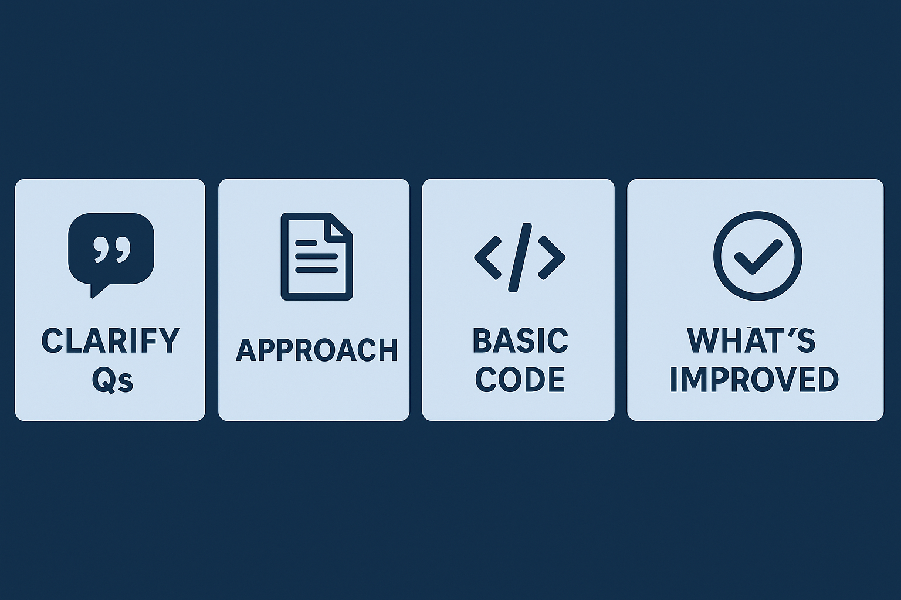

## Ready to ace your next SDET coding interview? Use this proven blueprint to structure every solution



**Author:** Lamhot Siagian 🔗 [LinkedIn](https://www.linkedin.com/in/lamhotsiagian)

---

1. **Clarifying Questions**
2. **High-Level Approach**
3. **Positive & Negative Test Cases**
4. **Basic Solution** (clean, easy-to-understand Java)
5. **Improved Solution** (more concise)
6. **What We Improved**


## 1. Two Sum

**Clarifying Questions**

* Exactly one solution?
* Zero- or one-based indices?
* Can numbers be negative or zero?
* What to return if no pair exists?

**Approach**
Single-pass `HashMap` to track seen numbers and indices; for each `num`, check if `target − num` is already in the map.

**Test Cases**

| Case        | Input                        | Output    |
| ----------- | ---------------------------- | --------- |
| Normal      | `nums=[2,7,11,15], target=9` | `[0,1]`   |
| Duplicates  | `nums=[3,3], target=6`       | `[0,1]`   |
| Negatives   | `nums=[-3,4,3,90], target=0` | `[0,2]`   |
| Single elem | `nums=[1], target=2`         | Exception |
| Empty array | `nums=[], target=5`          | Exception |

### Basic Solution

```java
public int[] twoSum(int[] nums, int target) {
    Map<Integer,Integer> map = new HashMap<>();
    for (int i = 0; i < nums.length; i++) {
        int comp = target - nums[i];
        if (map.containsKey(comp)) {
            return new int[]{ map.get(comp), i };
        }
        map.put(nums[i], i);
    }
    throw new IllegalArgumentException("No two sum solution");
}
```

### Improved Solution
```java
public int[] twoSum(int[] nums, int target) {
    Map<Integer,Integer> seen = new HashMap<>();
    for (int i = 0; i < nums.length; i++) {
        int want = target - nums[i];
        if (seen.containsKey(want)) {
            return new int[]{ seen.get(want), i };
        }
        seen.put(nums[i], i);
    }
    throw new IllegalArgumentException("No solution");
}
```

**What We Improved**

* **Variable names** (`seen`, `want`) clearly convey role.
* **Removed verbosity** in exception message.

---

## 2. Valid Parentheses

**Clarifying Questions**

* Allowed brackets: `()[]{}`?
* Ignore or reject non-bracket chars?
* Is empty string valid?

**Approach**
Push open brackets on a stack; on closing, check the top matches; reject otherwise. At end, stack must be empty.

**Test Cases**

| Case           | Input      | Output  |
| -------------- | ---------- | ------- |
| Mixed valid    | `"()[]{}"` | `true`  |
| Simple invalid | `"(]"`     | `false` |
| Mismatch order | `"([)]"`   | `false` |
| Empty string   | `""`       | `true`  |
| Leading close  | `"]"`      | `false` |

### Basic Solution

```java
public boolean isValid(String s) {
    Map<Character, Character> pairs = Map.of(')', '(', ']', '[', '}', '{');
    Deque<Character> stack = new ArrayDeque<>();
    for (char c : s.toCharArray()) {
        if (pairs.containsValue(c)) {
            stack.push(c);
        } else if (pairs.containsKey(c)) {
            if (stack.isEmpty() || stack.pop() != pairs.get(c)) return false;
        } else {
            return false;
        }
    }
    return stack.isEmpty();
}
```

### Improved Solution

```java
public boolean isValid(String s) {
    Deque<Character> stack = new ArrayDeque<>();
    for (char c : s.toCharArray()) {
        switch (c) {
            case '(': case '[': case '{':
                stack.push(c); break;
            case ')': if (stack.isEmpty() || stack.pop()!='(') return false; break;
            case ']': if (stack.isEmpty() || stack.pop()!='[') return false; break;
            case '}': if (stack.isEmpty() || stack.pop()!='{') return false; break;
            default:
                return false;
        }
    }
    return stack.isEmpty();
}
```

**What We Improved**

* **Switched to `switch`** on `char` for O(1) matching.
* **Eliminated map** and intermediate lookups for brevity.

---

## 3. Reverse Linked List

**Clarifying Questions**

* Singly linked list?
* In-place reversal?
* Return value for empty list?

**Approach**
Iteratively rewire `next` pointers, tracking `prev` and `head`.

**Test Cases**

| Case           | Input       | Output      |
| -------------- | ----------- | ----------- |
| Multiple nodes | `1→2→3→4→5` | `5→4→3→2→1` |
| Single node    | `1`         | `1`         |
| Empty list     | `null`      | `null`      |

### Basic Solution

```java
public ListNode reverseList(ListNode head) {
    ListNode prev = null, curr = head;
    while (curr != null) {
        ListNode nextTemp = curr.next;
        curr.next = prev;
        prev = curr;
        curr = nextTemp;
    }
    return prev;
}
```

### Improved Solution

```java
public ListNode reverseList(ListNode head) {
    ListNode prev = null;
    while (head != null) {
        ListNode next = head.next;
        head.next = prev;
        prev = head;
        head = next;
    }
    return prev;
}
```

**What We Improved**

* **Inlined `curr`** to `head` and renamed `nextTemp` to `next` for clarity.
* **Reduced variables** while preserving `O(n)` in-place logic.

---

## 4. Merge Intervals

**Clarifying Questions**

* Are intervals pre-sorted?
* Inclusive endpoints?
* Behavior on empty input?

**Approach**
Sort by start; iterate and merge overlaps by updating `current[1]` or starting a new interval.

**Test Cases**

| Case            | Input                          | Output                   |
| --------------- | ------------------------------ | ------------------------ |
| Overlapping     | `[[1,3],[2,6],[8,10],[15,18]]` | `[[1,6],[8,10],[15,18]]` |
| No overlap      | `[[1,4],[5,6]]`                | `[[1,4],[5,6]]`          |
| Nested          | `[[1,10],[2,3],[4,8]]`         | `[[1,10]]`               |
| Single interval | `[[5,7]]`                      | `[[5,7]]`                |
| Empty list      | `[]`                           | `[]`                     |

### Basic Solution

```java
public int[][] merge(int[][] intervals) {
    if (intervals.length <= 1) return intervals;
    Arrays.sort(intervals, Comparator.comparingInt(a -> a[0]));
    List<int[]> merged = new ArrayList<>();
    int[] current = intervals[0];
    for (int[] next : intervals) {
        if (next[0] <= current[1]) {
            current[1] = Math.max(current[1], next[1]);
        } else {
            merged.add(current);
            current = next;
        }
    }
    merged.add(current);
    return merged.toArray(new int[merged.size()][]);
}
```

### Improved Solution

```java
public int[][] merge(int[][] intervals) {
    if (intervals.length < 2) return intervals;
    Arrays.sort(intervals, (a, b) -> a[0] - b[0]);
    List<int[]> out = new ArrayList<>();
    int[] cur = intervals[0];
    for (int[] next : intervals) {
        if (next[0] <= cur[1]) {
            cur[1] = Math.max(cur[1], next[1]);
        } else {
            out.add(cur);
            cur = next;
        }
    }
    out.add(cur);
    return out.toArray(new int[out.size()][]);
}
```

**What We Improved**

* **Lambda sort** for brevity.
* **Simplified variable names** (`cur`, `out`) and unified merge logic.

---

## 5. Binary Tree Level Order Traversal

**Clarifying Questions**

* Return each level as a list?
* `null` root result?

**Approach**
BFS with a queue: for each level, process all nodes in the queue and enqueue their children.

**Test Cases**

| Case        | Input                     | Output                |
| ----------- | ------------------------- | --------------------- |
| Full tree   | `[3,9,20,null,null,15,7]` | `[[3],[9,20],[15,7]]` |
| Single node | `[1]`                     | `[[1]]`               |
| Empty tree  | `null`                    | `[]`                  |
| Left-only   | `[1,2,null,3]`            | `[[1],[2],[3]]`       |
| Right-only  | `[1,null,2,null,3]`       | `[[1],[2],[3]]`       |

### Basic Solution

```java
public List<List<Integer>> levelOrder(TreeNode root) {
    List<List<Integer>> result = new ArrayList<>();
    if (root == null) return result;
    Queue<TreeNode> queue = new ArrayDeque<>();
    queue.offer(root);
    while (!queue.isEmpty()) {
        int size = queue.size();
        List<Integer> level = new ArrayList<>();
        for (int i = 0; i < size; i++) {
            TreeNode node = queue.poll();
            level.add(node.val);
            if (node.left  != null) queue.offer(node.left);
            if (node.right != null) queue.offer(node.right);
        }
        result.add(level);
    }
    return result;
}
```

### Improved Solution

```java
public List<List<Integer>> levelOrder(TreeNode root) {
    List<List<Integer>> levels = new ArrayList<>();
    if (root == null) return levels;
    Queue<TreeNode> q = new ArrayDeque<>(List.of(root));
    while (!q.isEmpty()) {
        int sz = q.size();
        List<Integer> level = new ArrayList<>(sz);
        for (int i = 0; i < sz; i++) {
            TreeNode n = q.poll();
            level.add(n.val);
            if (n.left  != null) q.add(n.left);
            if (n.right != null) q.add(n.right);
        }
        levels.add(level);
    }
    return levels;
}
```

**What We Improved**

* **Initialized queue** with `List.of(root)` for brevity.
* **Pre-sized `level` list** to avoid dynamic resizing.

---

These paired solutions illustrate how clear variable naming, concise language features (lambdas, switch on char, `List.of`), and removing unnecessary boilerplate can maintain optimal time/space complexity while improving readability and maintainability.
