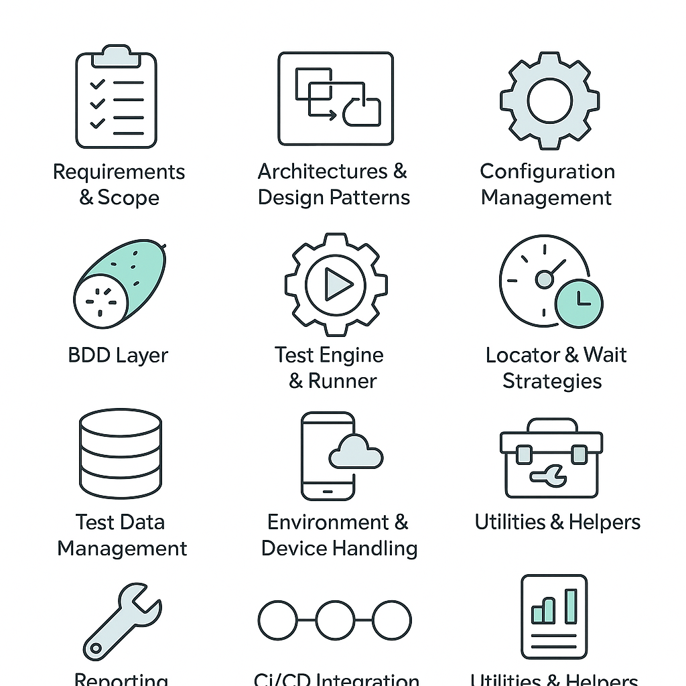

# How did you build a robust mobile-testing automation framework?
When you’re asked “How did you build a robust mobile-testing automation framework?” in an interview, aim for a STAR-style response that highlights why you made each choice, what you built, and the impact it delivered. Here’s a template plus a concrete example:



**Curated by:** Lamhot Siagian 🔗 [LinkedIn](https://www.linkedin.com/in/lamhotsiagian)
Here are five top YouTube videos that align perfectly with building a robust, AI-powered, BDD-driven mobile-testing framework:

1. **Appium Cucumber BDD Framework | Java + Maven + Extent Report**
   A hands-on tutorial showing how to integrate Appium with Cucumber/Gherkin, drive scenarios in Java/Maven, and generate rich ExtentReports. ([YouTube][1])

2. **Mobile Test Automation Tools for 2024 and beyond**
   An up-to-date overview of the leading mobile test-automation tools, cloud labs, and emerging best practices you need to know this year. ([YouTube][2])

3. **3 – Write your first Cucumber Test with Gherkin Feature File**
   Step-by-step walkthrough on crafting your very first BDD scenario in Gherkin and wiring up step definitions in Java. ([YouTube][3])

4. **Make Selenium Smarter with GenAI | Self-Healing Locators & AI**
   Demo of how generative AI can detect UI changes, auto-update locators, and dramatically reduce test flakiness. ([YouTube][4])

5. **LLMs and Test Automation: A New Era of Self Healing**
   Exploration of leveraging large language models to analyze failures, predict flaky tests, and continuously improve your automation suite. ([YouTube][5])

[1]: https://www.youtube.com/watch?v=qXdZ80hRBzI&utm_source=chatgpt.com "Appium Cucumber BDD Framework | Java + Maven + Extent Report"
[2]: https://www.youtube.com/watch?v=brOKeXg5ni4&utm_source=chatgpt.com "Mobile Test Automation Tools for 2024 and beyond - YouTube"
[3]: https://www.youtube.com/watch?pp=ygUJI2JkZHN0ZXBz&v=t54-83glFaM&utm_source=chatgpt.com "3 - Write your first #Cucumber Test with (#Gherkin) Feature File"
[4]: https://www.youtube.com/watch?v=2uugc7aJKW8&utm_source=chatgpt.com "Make Selenium Smarter with GenAI | Self-Healing Locators & AI ..."
[5]: https://www.youtube.com/watch?v=HmQoAHCUGxo&utm_source=chatgpt.com "LLMs and Test Automation: A New Era of Self Healing | Shray Sharma"

## 1. Context & Requirements

1. **Situation**

    * “Our team needed end-to-end regression coverage for both Android and iOS apps, across emulators, real devices, and cloud labs.”
2. **Business Goals**

    * Fast feedback on every commit
    * Low flakiness (< 5%)
    * Clear pass/fail metrics for stakeholders

## 2. Architecture & Design Principles

1. **Modular & Layered**

    * **Page Object Model** (POM) to abstract UI interactions
    * **Services/Helpers** layer for common utilities (logging, REST calls, data setup)
2. **Configurable & Extensible**

    * Central `config.json` (or YAML) for device targets, environments, timeouts
    * Plugin-based test-data loaders or device-farm connectors
3. **Reusability**

    * Shared “core” library with wrappers around Appium, custom wait strategies, retry logic
    * Helper methods for common gestures (swipe, pinch, scroll)

## 3. Technology Stack & Tooling

1. **Test Engine**: Appium + TestNG (or JUnit 5)
2. **Language**: Java/Kotlin (or JS/Swift for cross-team)
3. **Dependency Mgmt**: Maven/Gradle or npm
4. **Reporting**: Allure / ExtentReports + Slack/email alerts
5. **CI/CD**: Jenkins / GitHub Actions / GitLab CI

## 4. Device & Environment Management

1. **Local + Real Devices**: Emulators/sims + USB-connected real devices
2. **Cloud Labs**: BrowserStack, Sauce Labs, Firebase Test Lab
3. **Parallelization**: TestNG `@DataProvider` or JUnit’s concurrent execution

## 5. Stability & Flakiness Reduction

1. **Smart Waiting**: Fluent waits + retry logic for transient pop-ups
2. **Resilient Locators**: Prefer accessibility IDs → resource IDs → XPaths
3. **Isolation**: Reset app state (deep links, reinstall) between tests

## 6. Test Data & State Management

1. **Externalized Data**: JSON/CSV fixtures or builder patterns
2. **Service Virtualization**: WireMock or similar to mock backend
3. **DB Seeding/Cleanup**: REST hooks or direct connections for fresh state

## 7. Reporting, Metrics & Feedback

1. **Dashboards**: Allure trends (flaky tests, execution time)
2. **KPIs**: Coverage %, build-break rates, avg. test execution time
3. **Notifications**: Slack bot with screenshots & logs; daily summary email

## 8. Maintenance & Scalability

1. **Coding Standards**: Checkstyle/ESLint, shared style guide
2. **Code Reviews**: Enforce stability & readability for new tests
3. **Versioning**: Tag framework releases; maintain backwards compatibility
4. **Platform Extensions**: Recipe for adding React Native or WebView tests

## 9. Process & Team Enablement

1. **Documentation**: README, architecture diagrams, how-to guides
2. **Onboarding**: Pair-programming, sample test templates
3. **Ownership**: Rotate a “framework champion” to triage issues

## 10. Wrap-Up with Impact

* **Result**: “90 % regression coverage, feedback time ↓ 70 % (45 → 12 min), flakiness ↓ 3 %.”
* **Learning**: Balanced parallel speed with targeted retries, and enforced shared guidelines.

## 11. AI & ML-Driven Efficiency

1. **AI-Powered Test Generation**: LLMs to draft scenarios & starter Appium scripts from user stories
2. **Self-Healing Locators**: AI-driven element identification and auto-updates (Test.ai, Mabl)
3. **Visual Validation**: Applitools Eyes for pixel-plus-semantic screenshot comparison
4. **Test Prioritization**: ML models flag flaky tests and rank by risk impact
5. **Root-Cause Analysis**: AI parses logs and clusters failures with probable fixes
6. **NL-to-Script**: IDE/CLI plugins that convert “verify login” into Page Object calls
7. **Continuous Learning**: Feed outcomes back to refine waits, locators, and ordering

## 12. BDD & Gherkin Integration

1. **Living Documentation**

    * Write **business-readable** feature files in Gherkin:

      ```gherkin
      Feature: User Login
        As a registered user
        I want to log in
        So that I can access my dashboard
 
        Scenario Outline: Successful login
          Given the app is launched on <device>
          When I enter valid credentials for "<userType>"
          And I tap “Login”
          Then I should see the dashboard home screen
 
        Examples:
          | device     | userType  |
          | Android-11 | standard  |
          | iOS-14     | premium   |
      ```
    * Keeps requirements and tests in sync, readable by non-tech stakeholders.

2. **Cucumber (or JBehave)/Step Definitions**

    * Map Gherkin steps to reusable step definitions in Java/Kotlin:

      ```java
      @Given("the app is launched on {string}")
      public void launchApp(String device) { … }
 
      @When("I enter valid credentials for {string}")
      public void enterCredentials(String userType) { … }
 
      @Then("I should see the dashboard home screen")
      public void verifyDashboard() { … }
      ```
    * Leverage hooks (`@Before`, `@After`) to manage app state and data setup.

3. **Collaboration & Review**

    * Business analysts and QA write and review feature files together
    * Feature files double as acceptance criteria, reducing ambiguity.

4. **Parallel BDD Execution**

    * Tag scenarios (`@smoke`, `@regression`) and use TestNG’s tags to include/exclude sets
    * Execute Gherkin suites across device farms in parallel.

5. **Reporting**

    * Cucumber’s HTML reports alongside Allure, with scenario-level pass/fail and screenshots
    * Traceability matrix from features → step definitions → code coverage.

---

### Final STAR Recap

> **S**ituation: Manual regressions on Android/iOS were slow and brittle.
>
> **T**ask: Build a maintainable, fast, reliable, AI-enhanced, and BDD-driven framework.
>
> **A**ction:
>
> * Modular Java+Appium+TestNG stack
> * Feature files in Gherkin, step definitions in Cucumber
> * AI for script generation, self-healing locators, visual testing, and predictive analytics
> * CI pipelines in Jenkins, parallel cloud execution, Allure + Cucumber reporting, Slack alerts
> * Team docs, coding standards, and review practices.
>
> **R**esult: 90 % coverage, 12 min CI feedback, flakiness under 3 %, 50 % faster onboarding, living BDD specs that everyone trusts.

This comprehensive answer shows you’ve thought through architecture, process, AI/ML accelerators, and BDD practices—proving you can deliver a truly robust mobile-testing framework.
